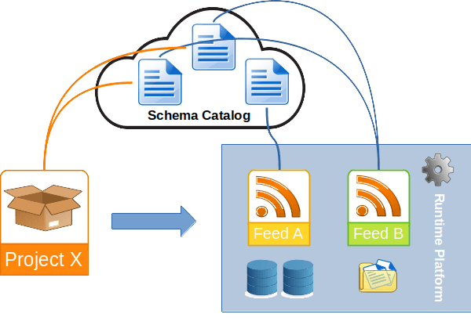

 .. Licensed to the Apache Software Foundation (ASF) under one
    or more contributor license agreements.  See the NOTICE file
    distributed with this work for additional information
    regarding copyright ownership.  The ASF licenses this file
    to you under the Apache License, Version 2.0 (the
    "License"); you may not use this file except in compliance
    with the License.  You may obtain a copy of the License at
 ..   http://www.apache.org/licenses/LICENSE-2.0
 .. Unless required by applicable law or agreed to in writing,
    software distributed under the License is distributed on an
    "AS IS" BASIS, WITHOUT WARRANTIES OR CONDITIONS OF ANY
    KIND, either express or implied.  See the License for the
    specific language governing permissions and limitations
    under the License.

Input & Output
==============

ForML comes with a unique approach to data access. For projects to be portable, they must not be coupled directly with
any specific data storages or formats - which for a data-processing framework might sound a bit self-contradictory.

In ForML architecture, all runtime dependencies including the pipeline I/O are handled by the :doc:`platform <platform>`
while :doc:`projects <project>` themselves are in this regard independent referring only to the intermediary
`catalogized schemas`_ described bellow.

The two main subsystems a platform uses to handle the pipeline I/O are described further in standalone sections:

* :doc:`feed` - resolving project defined ETL and supplying the requested data
* :doc:`sink` - consuming the pipeline output

Payloads
--------

agnostic, compatibility is users choice/responsibility

.. _io-catalogized-schemas:

Catalogized Schemas
-------------------

To achieve data access independence, ForML introduces a concept of *catalogized schemas*. Instead of implementing
direct operations on specific data source instances, the :doc:`dsl` used to define the input data ETL refers only
to abstract data *schemas*. It is then the responsibility of the *platform* to resolve the requested schemas (and the
whole ETL queries specified on top of that) mapping them to actual datasources hosted in the particular runtime
environment.

This approach can also be seen as *datasource virtualization*. ForML projects work with datasets regardless of their
particular physical format or storage technology.

A schema catalog is a logical group of schemas which both - projects and platforms - can use as a mutual data proxy.
It is not a service or a system, rather a namespaced descriptor implemented simply as python module(s) that must be
available to both the project expecting the particular data and the platform supposed to serve that project. When
a project pipeline is submitted to any given platform, it attempts to resolve the schemas referred in the project DSL
using its configured schema-datasource mappings and only when all of these schema dependencies can be satisfied with
available data sources, the platform is able to launch that pipeline.

An obvious aspect of the schema catalogs is their decentralization. Currently, there is no naming convention for the
schema definition namespaces. Ideally, schemas should be published and held in namespaces of the original data
producers. For private first-party datasets (ie. internal company data) this is easy - the owner (motivated to use
ForML) would just maintain a (private) package with schemas of their data sources. For public datasets (whose authors
don't endorse ForML yet) this leaves it to some (not yet established) community maintained schema catalogs.

TODO: openschema

See the :doc:`dsl` for a schema implementation guide.

.. _io-source-descriptor:

Source Descriptor
-----------------

ForML projects specify their input data requirements (mainly the ETL :doc:`DSL <dsl>` query optionally composed
with other transforming operators) in form of a *source descriptor* (supplied within the :doc:`project structure
<project>` using the :ref:`source.py <project-source>` component).

Part of the dataset specification can also be a reference to the *ordinal* column (used for
determining data ranges for splitting or incremental operations) and *label* columns for
supervised learning/evaluation.

This descriptor is created using the ``project.Source.query()`` class method:

.. automethod:: forml.project.Source.query

.. note:: The descriptor allows to further compose with other operators using the usual ``>>`` syntax. Source
          composition scope is separate from the main pipeline so adding an operator to the source
          composition vs pipeline composition might have a different effect.
