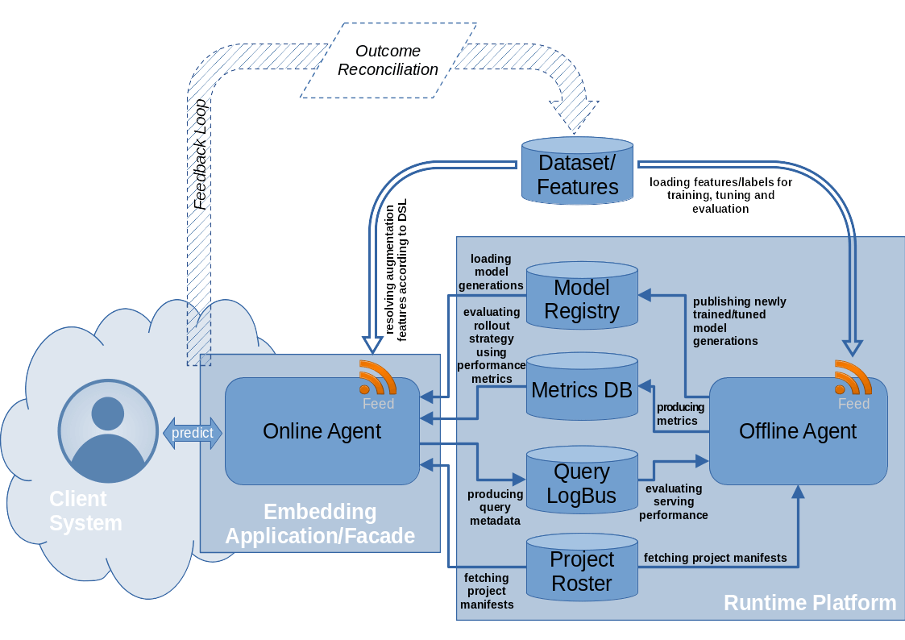

 .. Licensed to the Apache Software Foundation (ASF) under one
    or more contributor license agreements.  See the NOTICE file
    distributed with this work for additional information
    regarding copyright ownership.  The ASF licenses this file
    to you under the Apache License, Version 2.0 (the
    "License"); you may not use this file except in compliance
    with the License.  You may obtain a copy of the License at
 ..   http://www.apache.org/licenses/LICENSE-2.0
 .. Unless required by applicable law or agreed to in writing,
    software distributed under the License is distributed on an
    "AS IS" BASIS, WITHOUT WARRANTIES OR CONDITIONS OF ANY
    KIND, either express or implied.  See the License for the
    specific language governing permissions and limitations
    under the License.

Serving Engine
==============

In addition to the basic :ref:`CLI driven <platform-cli>` isolated batch mode, ML projects implemented on ForML can be
embedded into a dynamic serving layer and operated in an autonomous *full-cycle* fashion. This layer continuously serves
the following functions:

* incremental training
* tuning
* ongoing performance reporting
* dynamic rollout strategies

Feedback Loop
-------------

In order to autonomously provide the full-cycle serving capabilities for a supervised ML project, there needs to be
a programmatically reachable event-outcome feedback loop defined as an external reconciliation path providing
a knowledge of the true outcome for every event the system is predicting for.

Implementation of this feedback loop (the reconciliation logic) is in scope of the particular business application and
its data architecture to which ForML simply plugs into using its :doc:`feed system<feed>`.

The key attribute of this feedback loop is its *latency* which determines the turnaround time for all the serving
functionality like performance monitoring, incremental training etc.

.. _serving-components:

Components
----------

The serving capabilities are provided through a number of additional :doc:`platform components <platform>` as explained
in the following sections.

Online Agent
''''''''''''

Online agent is the most apparent serving component responsible for answering the event queries with actual
predictions. In scope of this process it needs to go through set of essential steps (some of them are part of
agent bootstrapping or periodical cache refreshing while others are synchronous with each query):

1. Fetching the serving manifest from the *project roster*.
2. Selecting a particular model generation using the dynamic *rollout strategy* as defined in the serving manifest.
3. Loading the selected model generation from the :doc:`model registry<registry/index>`.
4. Fetching all missing input features for augmenting the particular request according to the project
   :ref:`input DSL <concept-dsl>`.
5. Running the prediction pipeline and responding with the result.
6. Submitting query metadata to the *query logbus*.

The rollout workflow employed by the agent is a powerful concept allowing to select particular model/generation
dynamically based on the project-defined function of any available parameters (mainly the performance metrics). This
allows to implement strategies like *canary deployment*, *multi-armed bandits*, *A/B testing*, *cold-start* or
*fallback* models etc.

The serving agent is expected to be embedded into a particular application layer (ie web/rest service) to provide the
actual frontend facade.

Project Roster
''''''''''''''

This is a tiny storage service used by the serving layer to pickup list of active projects and their serving
manifests. It gets updated as part of project deployment promotion and continuously watched by the online/offline
agents to determine things like the model generation selection.

Query LogBus
''''''''''''

Standard publisher-subscriber software bus for distributing the serving queries metadata to allow for further (offline)
processing like the performance reporting or general debugging. The typical attributes sent to the query logbus per each
event are:

* timestamp
* query ID
* project + version
* query fields
* obtained augmentation features
* prediction result
* latency

PerfDB
''''''

Another storage service for aggregating the performance metric as time series derived from both the metadata pushed via
*query logbus* as well as the main *feedback loop* and produced by the *offline agent* processing.

The PerfDB is a crucial source of information not only for any sorts of operational monitoring/reporting but
especially for the dynamic model generation selection performed by the online agent according to the rollout strategy
when serving the actual event queries.

The typical available metrics are:

* per project:

  * per model generation:

    * serving latency (gauge)
    * number of requests (counter)
    * loss function value
    * auxiliary project-defined metrics

  * loss function value

Offline Agent
'''''''''''''

Offline agent is the backend service responsible for doing all the heavy processing of:

* (incremental) *training* and *tuning* of new model generations (pushed to the :doc:`model registry<registry/index>`)
* *evaluating* project performance (pushed to the `PerfDB`_)
