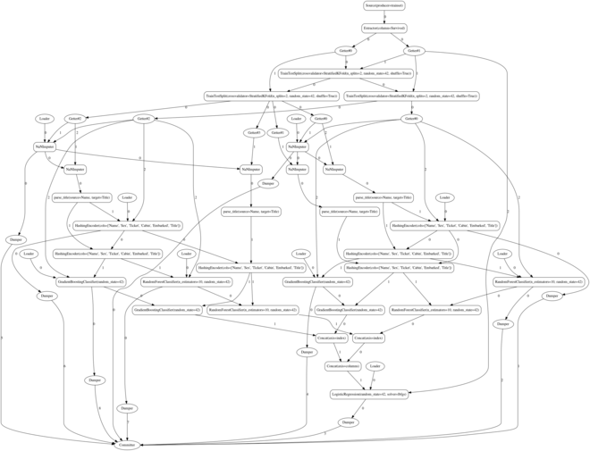
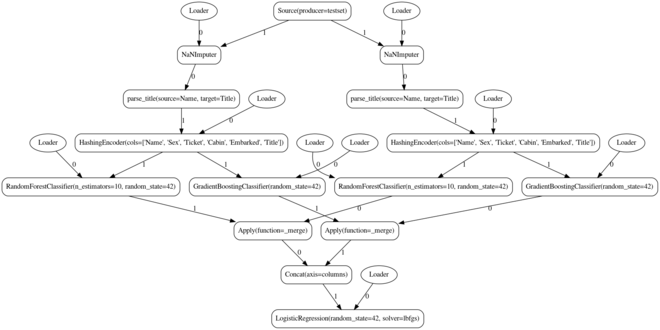

Tutorial
========

There is a complete ForML project available under ``examples/tutorial/titanic/``. We will use this instance here to
demonstrate the typical ForML usecases.

Before you start, please make sure to install ForML as per the :doc:`installation` instructions.

Project Operations
------------------

We will exercise the standard :doc:`lifecycle` actions.

Development Lifecycle Actions
'''''''''''''''''''''''''''''

1. Change directory to the root of the ``titanic`` project working copy.
2. Let's first run all the operator unit tests to confirm the project is in good shape::

    $ python3 setup.py test
    running test
    TestNaNImputer
    Test of Invalid Params ... ok
    TestNaNImputer
    Test of Not Trained ... ok
    TestNaNImputer
    Test of Valid Imputation ... ok
    TestTitleParser
    Test of Invalid Params ... ok
    TestTitleParser
    Test of Invalid Source ... ok
    TestTitleParser
    Test of Valid Parsing ... ok
    ----------------------------------------------------------------------
    Ran 6 tests in 0.591s

    OK

3. Try running the ``train`` mode on the ``graphviz`` runner to see the train task graph::

    $ python3 setup.py train --runner graphviz

4. Run the ``score`` mode on the (default) ``dask`` runner to get the cross-validation score::

    $ python3 setup.py score
    0.6531806857218416

5. Create the project package artifact and upload it to the (default) local registry (assuming the same linage doesn't
   already exist - otherwise increment the project version in the ``setup.py``)::

    $ python3 setup.py bdist_4ml upload

   This should publish the project into your local forml registry making it available for the production lifecycle.

Production Lifecycle Actions
''''''''''''''''''''''''''''

Production lifecycles doesn't need the project working copy so feel free to change the directory to another location
before executing the commands.

1. List the local registry confirming the project has been published::

    $ forml list
    forml-example-titanic
    $ forml list forml-example-titanic
    0.1.dev0
    $ forml list forml-example-titanic 0.1.dev0

   The output shows the project artifact is available in the registry as a lineage ``0.1.dev0`` not having any
   generation yet (the last command not producing any output).

2. Train the project to create the first generation of its models and list the registry to confirm it got persisted::

    $ forml train forml-example-titanic
    $ forml list forml-example-titanic 0.1.dev0
    1

   Now we have our first generation of the titanic models available in the registry.

3. Apply the trained generation of the project to get the predictions::

    $ forml apply forml-example-titanic
    [[0.59180614 0.40819386]
    [0.60498469 0.39501531]
    ...
    [0.61020908 0.38979092]
    [0.64064548 0.35935452]]

4. Run the ``apply`` mode alternatively on the ``graphviz`` runner to explore its task graph::

    $ forml -R graphviz apply forml-example-titanic

Working with Jupyter Notebooks
------------------------------

See the tutorial notebook stored in the demo project under ``examples/tutorial/titanic/notebooks/tutorial.ipynb`` for
a step-by-step examples of working with ForML project in Jupyter.

Further details on the interactive style of work with ForML in general can be found in the :doc:`interactive` sections.
